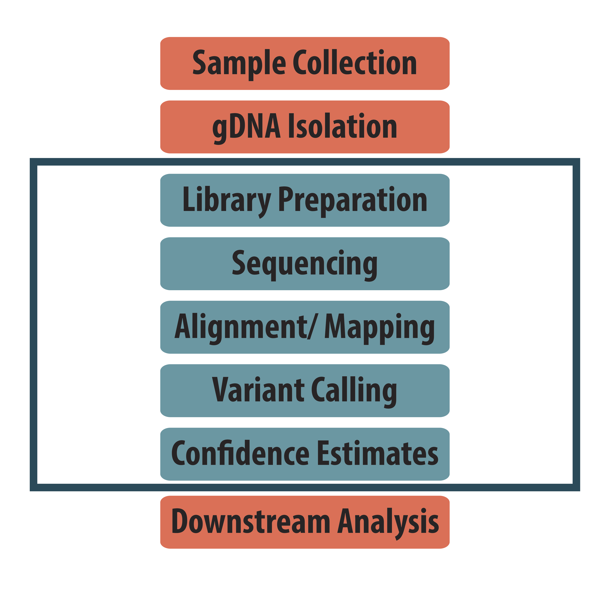
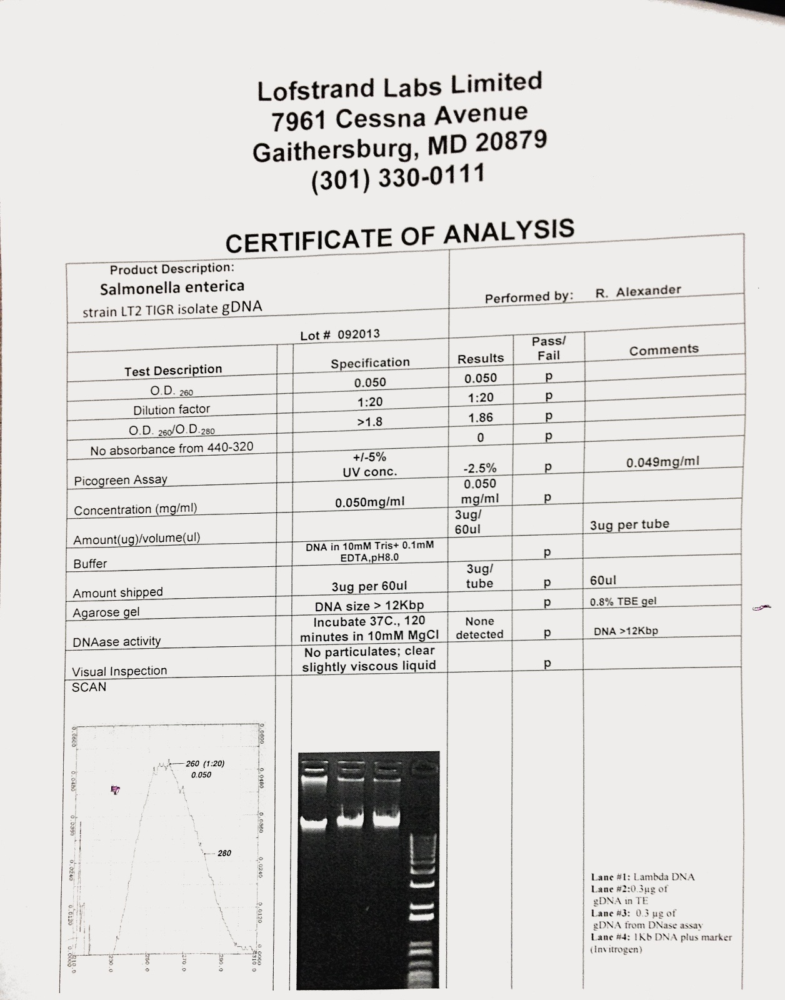
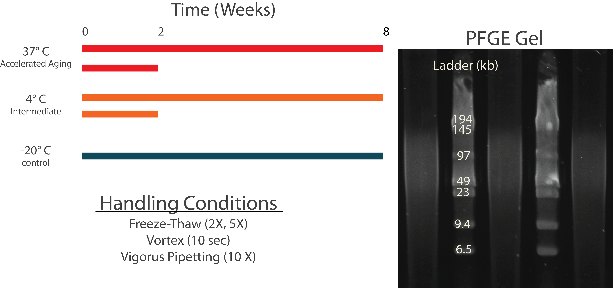
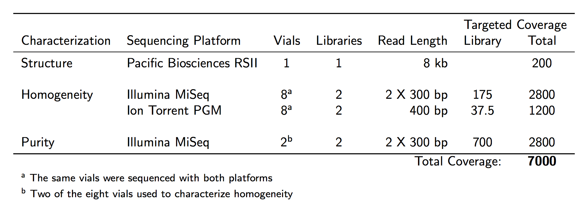

# Introduction
* General material background
  * Planned material use

  * Interagency agreement for the material

# Material aquision 
* Desired material attributed
  * number of vials ~ 1000 vials
  * DNA concentration ~ 50 ng/ul
  * DNA mass ~ 3ug
  * DNA size ?
  * DNA purity A260/280 1.8-20?
* Primary reserach
  * vendors and price points
* Material procured
  * Lofstrand
    * Certificate of Analysis

* Additional supporting material
  * agarose plugs
  * culture stocks
    * additional experiments
    * future batches
    * distribution to culture collections
* Vial organization
  * [Vial sampling design](https://www.evernote.com/shard/s17/nl/1951831/23e7b6e8-052f-43dd-a6e1-295ac45c2738/)

# Material Selection
*Salmonela enteria* relevance to food borneoutbreaks
Initially sequenced in 2001 (REF)
Strain obtained from the FDA, which it originally received from TIGR

# Material Characterization


## DNA stability
* Summary of PFGE method
* Homogeneity and stability experimental design


* Data analysis methods

## Sequencing experimental design
* vials and sequencing platform information

* Sequencing reagents, platforms ect.
* GenBank Accession numbers
```{r echo=FALSE}
library(knitr)
sra_acc = read.csv("supplemental/RM8375-SRA-numbers - Sheet1.csv")
```
* %TODO% add MiSeq acc's
```{r echo=FALSE, results='markup'}
kable(sra_acc)
```

## Non-NIST measurements
* PacBio
  * sequencing chemistry
  * platform information
* Opgen

## Genome Structure
* PacBio de-novo assembly
  * software versions
* Structure validation - OpGen
  * Opgen software version
* SNPs
  * variant calling pipeline
* Tools used for visualization/ analysis

## Genomic purity
* Pathoscope analysis of MiSeq and PGM
* Software version information and reference
* database information

## Sequence purity
* Pileup purity assessment
* Diagram/ flowchart with classification scheme
* methods used to analyze low confidence positions
  * visualization, correlation with biaes, and sequence context
## Sequence homogeneity
* Somatic variant calling pipeline

## Methods reproducibility
* Docker
* Github
* Pipelines
* R/Python scripts
* Software used

# Results
## DNA Stability
* example gel
* summary table
  
## Sequencing
* fastq data summary - table with read length, quality, throughput, base quality scores, coverage?
  
## Genomic Purity
* Contaminant composition and speculation regarding source
* Figure - distribution by taxa, log scale, or breakdown by dataset
* Removal of contaminants?
  
## Genome Structure
* PacBio Assembly characteristics - GC skew? others?
* OpGen vs PacBio
* SNP calls
  * bam alignments for hotspots
* Revise genome assembly
  * Pilon, other tools
    
## Sequence Purity
* Platform comparison scatter plot
* Classification scheme - proportion of bases in each class (Table)
* Analysis of low purity positions
  * correlation with biases
  * correlation with sequence context
  * view bam alignment

## Sequence homogeneity
* Somatic variant calls
* Genome assembly, parsnp

## Reported genome
* fasta
* bed
* gvcf

# Discussion 
* lessons learned

# Appendix
1. Lofstrand Certificate of analysis
2. Vial pull results
3. Agarose plug protocol provided by OpGen
4. PFGE gels